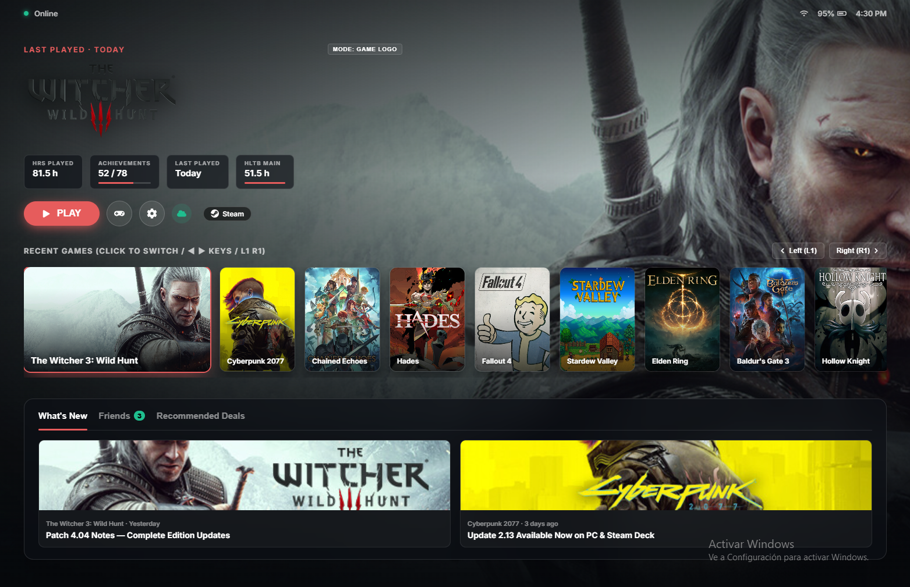
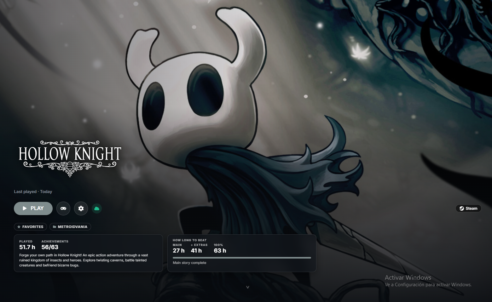
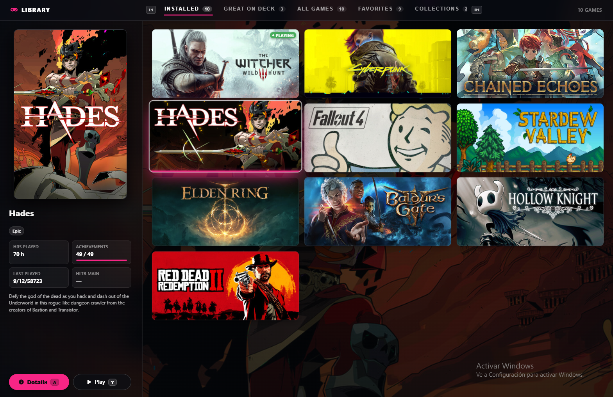
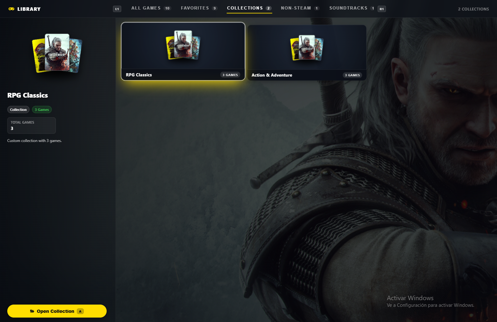

# Game Glance

A [Decky Loader](https://decky.xyz) plugin that turns Steam's game page in Game Mode into an immersive,
full-screen view with everything about a game at a glance: how long it takes to beat, how far you are,
what it is about, and where it came from.


<details>
<summary>More screenshots: a GOG game from Heroic, a TV, and the Quick Access menu</summary>


</details>

## What it does

- **Full-screen art.** The game's hero art fills the screen with its logo; Steam's Activity, Your stuff,
  Community and Game info tabs move to the next screen (press down).
- **Restyled Play row.** A pill-shaped Play button (including the "Play from" arrow some games have), round
  controller and settings buttons, and Steam Cloud as a small icon coloured by sync state.
- **Collection Pills.** Frosted-glass pill badges on the game page showing all collections and Favorites the game belongs to.
- **HowLongToBeat.** Main story, Main + Extras and 100% times, a progress bar toward the next one you have
  not reached, and how many hours are left.
- **Info card.** Your play time, achievements and the game's description, in your Steam language.
- **Store pill.** Where the game comes from, with the store's icon: Steam, GOG, Epic, Amazon, Battle.net,
  Ubisoft, Xbox Cloud or Heroic.
- **Non-Steam games.** Games added by [Heroic](https://heroicgameslauncher.com) or
  [Unifideck](https://github.com/mubaraknumann/unifideck) get their store, times and description too. On a
  Unifideck game's page, Unifideck's own Play row (Install, Play) sits on the art in the same style.
- **Works offline.** Times and descriptions are kept on the device. A Quick Access button pre-loads them for
  every installed game, and new installs are picked up automatically.
- **Handheld and TV.** Sizes follow the screen, so it looks the same docked to a TV.

## Visual Tour

> **Note on Screenshots:** The screenshots below (`homeview.png`, `gameview.png`, `gamelist.png`, `collections.png`, and `browser preview.png`) were captured directly from the **Browser Development Preview** environment. They illustrate the UI layout, components, and interaction patterns; minor differences (such as system fonts, margins, and native Steam overlays) may appear when running inside SteamOS Game Mode.

### Spotlight Home


### Game Details View


### Spotlight Library (Game List View)


### Collections View (5-Poster Fan Collage)


### Browser Development Preview


## Spotlight Home (new in 2.0)

Spotlight Home is an optional new Home screen. It is off by default; turn it on in Quick Access.

- **Selected game.** The selected game fills the screen with its art (your custom SteamGridDB art when you have
  set some), with chips (play time, achievements, last played, HowLongToBeat main story), a Play button and
  actions. The accent colour follows each game's art (accent text is lightened, hue kept, when the colour is too dark to read). Focus starts on the first game card, as on Steam's Home:
  **Left and Right** pick the previous or next game and **A** opens its page; **up** reaches Play and the other
  buttons. **L1 and R1** pick the previous or next game from anywhere above the tabs and put focus on Play (hold to keep
  going), for starting a game in two presses. For Steam games with cloud saves, a cloud button after the info button shows the
  sync state (green, yellow, red, grey) and opens Steam's sync dialog when there is a problem. The gear button, or
  the View/Select button, opens Steam's own menu for the game (favourites, collections, Manage, Properties...), the
  same one as on the game's page.
- **Recents row.** Your recent games as capsules, as many as Steam's own Home lists (up to 20; custom portrait art included); the selected one opens into a
  wide card with the game's landscape art (custom art included), highlighted while the row has focus, and the row slides
  to follow. The row ends in a Library card (Right or R1 past the last game, A opens the Library; again goes back to the
  first) with a faded preview of more games. B on the buttons or the tabs comes back to the cards. Tapping a card does
  nothing. With no recent games, Home shows an Open Library button. With **New to library** on, games Steam lists as new to
  your library (not played yet) join the row by the date they were added, marked NEW, with "New to library · Added …"
  above the title.
- **Feed.** Press down for tabs: **What's new** (news updates, which open the news; under them, as on Steam's Home, the
  games recently updated on this device, with the size and when), **Friends** (your friends, in game first, then online,
  away and offline, kept up to date while Home is open; the number online on the tab turns green when anyone is on,
  and each picture, a small square as in Steam, has a green frame when online or in game, a blue one when away; A on a friend
  in a game you can join asks, then joins them, as Steam's friends menu does; under them, Steam's own
  "Trending among friends" list as small cards: in library, on sale or free to play, and which friends play it) and **Recommended** (Play next
  from your library; under it, with Show wishlist deals on, up to six wishlist games on sale with their discount
  and price). Up and down move between the rows, L1 and R1 switch tabs; B goes back up to Play.
- **Details page to match.** With both toggles on, the Game Glance page gets the same look: accent eyebrow
  and title, a larger Play row and new cards, laid out as in the design. The store pill stays. With Spotlight
  Home off it looks exactly as it did in 1.1.1.
- **Store pill.** The selected game's store (Steam, GOG, Epic...) shows as a pill with its icon and name at the
  right of the Play row, the same pill as on the game page.
- **Status bar.** The time, battery (with a bolt while charging, red under 20%) and connection (Wi-Fi, wired or
  offline) sit in a glass pill at the top-right, near the screen edge. The clock follows Steam's 12/24-hour
  setting. Next to it, a small dot shows your own online status in the Friends tab's colours: green online (or in a
  game), blue away, grey invisible or offline. Moving up from the Play row to Steam's own top bar (search,
  notifications, your profile) fades the bar out; it comes back when focus returns to Home. Without a battery (a
  desktop) the battery is left out.

## Spotlight Library (new in 2.1)

Spotlight Library brings the same immersive visual treatment to Steam's Library page:

- **Game List View & Inspector.** Browse games in a grid of portrait posters. Highlighting any game reveals the side-by-side inspector panel with its hero poster, game logo/title, playtime, achievements, last played date, and HowLongToBeat times.
- **Configurable Grid Density.** Adjust the number of games per row between **3 and 7 columns** to fit your preference.
- **Collection Improvements & 5-Poster Fan Collage.** Collections appear with an elegant 5-poster fan collage preview. Entering a collection opens a dedicated game list with LB/RB bumper navigation to cycle quickly between collections. Soundtracks are organized into their own collection with a streamlined single action button (**A Open Soundtrack**).
- **Collection Pills on Game Details.** The Game Details view displays subtle frosted-glass pill badges between the action row and the metadata cards, showing every collection and Favorites category the game belongs to.
- **Navigation & Gamepad Polish.**
  - **Debounced navigation:** Smooth, precise analog stick and D-pad input without accidental double-skips.
  - **Steam Search Bar Integration:** Moving up from the category tabs navigates seamlessly into Steam's native top bar and search input.
  - **START / Menu Button:** Pressing the Menu (START) button on any game opens Steam's native context options dialog (Properties, Controller Settings, Manage, etc.).
  - **B Button to Home:** Pressing Back (B) when at the root of the library returns smoothly to Steam Deck Home.
  - **State Memory:** Retains your exact tab, collection, focused game, and scroll position when returning from Steam sub-screens (Properties, Controller settings, etc.).
- **Styling Tweaks & Visuals.**
  - **25% lighter backgrounds:** Enhanced contrast and ambient backdrop lighting.
  - **Home-styled tabs:** Category navigation tabs feature glowing accent underlines that sample the active game's color palette.
  - **Single solid accent color action buttons:** Clean, uniform accent styling for Play and Details action buttons.
  - **Recommended-card highlight:** Highlighted game cards feature a luminous border and a bottom accent bar matching Spotlight Home's card design.

## Browser Development Preview

For rapid local development, Game Glance includes a full **Vite-based browser playground**:

- Run `pnpm dev` or `npx vite` to launch the dev server in any web browser.
- Simulates the Decky UI, Steam client stores, navigation focus managers, and HowLongToBeat APIs.
- Preview and interactively test Spotlight Home, Game Details, Spotlight Library, Collections, and Quick Access settings with live hot-reloading and gamepad or keyboard controls.

## Install

Game Glance is not in the Decky plugin store. Install it from a release:

1. In Game Mode, open Decky → Settings → General and turn on **Developer mode**.
2. Download `game-glance.zip` from the [latest release](../../releases/latest).
3. Decky → Settings → Developer → **Install plugin from ZIP** (or **Install plugin from URL** with the
   release asset's link).

Later versions install from Game Mode: Quick Access → Game Glance → **Updates** shows when a newer release is out, and
**Update to …** hands it to Decky, which asks to confirm, installs it and reloads Game Glance.

If you use **HLTB for Deck**, you can uninstall it; Game Glance shows the same times on the game page.

## Settings

Quick Access (…) → Game Glance:

| Setting | Default | Description |
|---|---|---|
| **Game Glance page** | On | Immersive full-screen game page with HLTB stats and cards. Off restores Steam's default page. |
| **Spotlight Home** | Off | Replaces Steam's Home screen with the Spotlight Home experience. |
| **Spotlight Library** | Off | Replaces Steam's Library screen with the Spotlight Library experience. |
| **Library Grid Columns** | 3 | Slider from 3 to 7 columns to configure poster density in Spotlight Library. |
| **Prefer game logos** | On | Uses official or custom game logos instead of text titles across Home, Library, and Game Details. |
| **Clean look** | Off | Minimalist game page with a single bottom row of actions and playtime/HLTB summary. |
| **Status bar** | On | Shows clock, battery, connection, and online status pill in Steam's top bar on Spotlight Home. |
| **New to library** | Off | Includes newly added, unplayed games in Spotlight Home's recent games row. |
| **What's new, Friends, Recommended** | On | Displays the bottom feed tabs on Spotlight Home. |
| **Show wishlist deals** | Off | Shows discounted games from your public Steam wishlist on the Recommended tab. |
| **Pre-load game info for installed games** | On | Automatically caches descriptions and HLTB stats for installed games. |
| **Pre-load new games automatically** | On | Automatically fetches data when new games are installed. |
| **Clear cached data** | — | Clears local cache of descriptions and HLTB times. |
| **Updates** | — | Checks for newer releases and initiates Decky updates. |

## Compatibility

Tested on a ROG Xbox Ally running Bazzite, handheld and docked to a 1080p TV. It should work on a Steam Deck
and other SteamOS-like devices, but that has not been tested.

Steam updates can rename the parts of the page the theme styles. When that happens, Game Glance turns its
layout off and you get Steam's normal page with the cards on it, rather than a broken page.
[docs/device-checklist.md](docs/device-checklist.md) lists what to check after an update.

## Privacy

Game Glance talks to two sites for game data: howlongtobeat.com (times) and store.steampowered.com (descriptions). It sends
game names and Steam app IDs, nothing about you. The one exception is the optional **Show wishlist deals**
setting (off by default): it sends your Steam ID to Steam's web API (api.steampowered.com) to read your public
wishlist, then asks the store for the prices of the wishlist's games by app ID. Spotlight Home's news, friends,
status bar (battery and connection) and art come from the Steam client itself (news images load from Steam's image servers, as on Steam's own Home, and so does a game's full-screen art when Steam has not loaded it on the device yet). Trending's store art (for games you do not own, when Steam's "store content on Home" is on), the wishlist deal art with Show wishlist deals on, and your friends' avatars also load from Steam's image servers.
When you open Game Glance in Quick Access (once per session), the updater asks api.github.com for the latest release's details (version and download link); it sends nothing about you, and an update is only downloaded, by Decky, when you press Update.
Everything Game Glance stores stays on the device, in Decky's settings folder.

## Development

```bash
pnpm install
pnpm dev                          # browser development preview (Vite playground)
pnpm test                         # frontend tests
python3 -m venv .venv && .venv/bin/pip install pytest && .venv/bin/pytest tests/py
pnpm check:hltb                   # live check against howlongtobeat.com
scripts/package.sh                # builds out/game-glance.zip
```

A release is a GitHub release tagged `vX.Y.Z` (the version in `package.json`) with `out/game-glance.zip` attached as
`game-glance.zip`; the built-in updater compares that tag with the installed version.

`scripts/serve.sh` serves the zip on your network for **Install plugin from URL**. The `scripts/cef-*.mjs`
helpers drive Steam's UI through remote CEF debugging; see the device checklist for the setup.

## About this project

This is a personal project, maintained on a best-effort basis. Steam and HowLongToBeat change without
notice, so expect occasional breakage; issues are welcome.

The code was written with [Claude](https://claude.ai) (Anthropic's AI), directed, reviewed and tested on
device by the author.

## Credits

- HowLongToBeat lookup code from [HLTB for Deck](https://github.com/morwy/hltb-for-deck) (MIT), including the
  fix from its pull request #68 by beallio. See [THIRD_PARTY_LICENSES.md](THIRD_PARTY_LICENSES.md).
- Times from [HowLongToBeat](https://howlongtobeat.com). Store icons from Simple Icons and Font Awesome via
  [react-icons](https://react-icons.github.io/react-icons/).
- Not affiliated with Valve, HowLongToBeat, ASUS or any store shown.

## License

[MIT](LICENSE)
